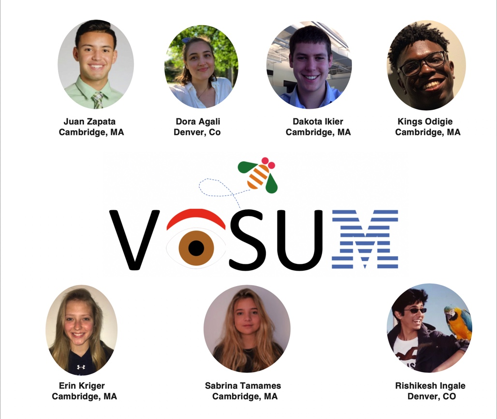
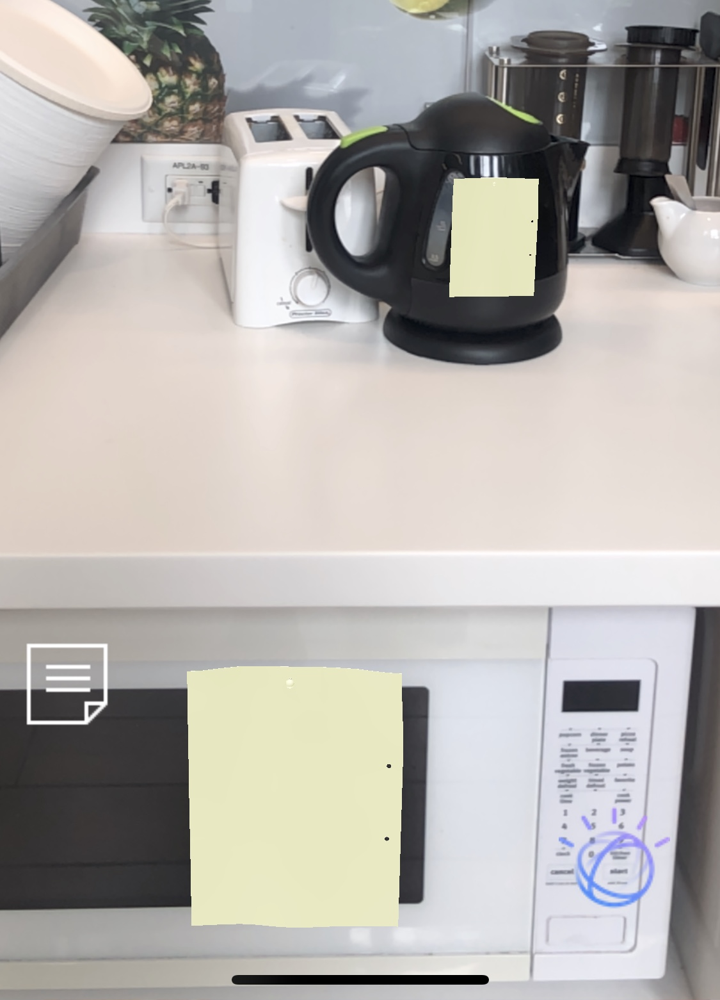

# Visum

<p align="center">
    
</p>

This repository contains the entire source code, built using ViroReact and React Native, for the Visum Application.

## Mission Statement
The Visum Team's mission is to alleviate the daily struggles of an Alzheimer's or dementia patient by utilizing Augmented Reality, IBM Cloud, Artificial Intelligence, and more in order to virtualize a patient's reminders and facial recognition processes.

## Contributers
 - Juan Zapata Gomez (juangomez@ibm.com)
    * Software Developer
 - Dora Agail (dagali@ibm.com)
    * Software Developer
 - Kings Odigie (kings.odigie@ibm.com)
    * Software Developer
- Sabrina Tamames (sabrina.tamames@ibm.com)
    * Offering Manager
 - Dakota Ikier (Dakota.William.Ikier@ibm.com)
    * Innovation & Product Research
 - Erin Kriger (Erin.Kriger@ibm.com)
    * Innovation & Product Research
 - Rishikesh Ingale (rishikesh.ingale@ibm.com)
    * Software Developer

## Installation
Follow the installation guide [here](https://docs.viromedia.com/docs/quick-start) to set up and run this source code locally on Mac/Linux (For setting up on Windows, go through Windows specific steps to setup Android Studio [here](https://docs.viromedia.com/docs/quick-start-windows) and [here](https://docs.viromedia.com/docs/installing-viro-android)

## Mac/Linux Instructions
1. Follow all instructions from the installation guide found above.
2. Within your repo:
    ```
    ./setup-ide.sh --ios
    cd ios
    gem install cocoapods
    pod install
    ```
4. 
    ```
    open VisumApp4.xcworkspace
    ```
5. For more information click [here]()

## Windows Instructions
1. Follow all the instructions from the installation guide found above.
2. Within your repo:
    ```
    ./setup-ide.sh android
    ```
3. For more information click [here](https://docs.viromedia.com/docs/installing-viro-android)

### Prerequisites
1. Make sure you have sign up on www.viromedia.com/signup and request an API Key
2. For iOS - Xcode 9 or later.
3. For Android - Android Studio for the Android SDK and tools.
  
    _Make sure to install the Android SDK and build tools for API level 26_

### Clone Repo
```
git clone https://github.ibm.com/juangomez/Visum
cd Visum
```
### Install and setup dependencies
#### All platforms
```
npm install
```
#### iOS
```
cd ios
pod install
```

## Building iOS App
For building iOS App via Xcode
1. Open Xcode workspace
    ```
    cd ios
    open VisumApp4.xcworkspace
    ```
2. Select correct Team and Provisioning Profiles for Signing the app in Xcode.
    * Must add the correct team and provisioning profiles for VisumApp4 and VisumApp4Tests
3. Click Play button to build and install

## Project Preview




## Problem Addressed

From diagnosis, Alzheimer's patients immediately see numerous symptoms that affect their day-to-day life: forgetting names, faces, items, and routines. In the early stages of the disease, patients often feel frustrated and anxious due to a sense of loss of independence, normalcy, and overall no control. These feelings often lead to depression and a faster-paced progression of the disease.

## Interviews

### Guillermo Vadell

    Has a mother with late term Alzheimer's (Caregiver)
    " This tool would really benefit my mother when she was first diagnosed. It would have helped her ease into the progression of the disease and made her feel more comfortable to have a technology to lean on in moments of doubt"

### Lourdes Magolnick

    Recently diagnosed with Early on-set Alzheimer's
    "I would love to use this app! As someone relatively young that's been diagnosed, I am excited to keep technology prevalent in my life. Plus, now I don't have to be worried to sticky notes falling off things"

### Enrique Fernandez
    Doctor who treats Alzheimer’s patients and other patients with cognitive disabilities
    "I really see the benefits for the quality of life for patients that this tool will provide. As a doctor, I am really interested in the ability to track their "sticky note count" to see how their disease has progressed"

## Problem solved

Team Visum's goal is to help Alzheimer's and Dementia patients regain a sense of independence and normalcy and overall higher their quality of life by providing users with virtual assistance, reminders, and facial recognition.

## IBM 1-3-9

#### 1. Purpose
    "Be Essential." Visum will be essential to our clients by relieving them of the painful confusion and anxiety that comes along with the many other symptoms of Alzheimer's memory loss.

#### 3. Values
    "Dedication, Innovation, Trust." Visum is focused on our users. We want to personally reach client success for every patient we work with to assist with daily routines and simplify their experience using our application. Visum is geared towards building new ways to creatively ease the burden for patients of remembering how to perform simple, daily tasks, relieving the caregiver of the constant angst and worry, and build lasting relationships with them in the process.

#### 9. Practices
    "Put the client first" - “See the world through the client's eyes."  Patient comfortability, preferences, and lifestyle are top priorities when designing Visum.

    "Listen for need, envision the future" - "We help them visualize themselves in a future that may not yet exist.”  Our team focuses on the patient’s challenges and aims to understand and reimagine how it can be tackled.

    "Share Expertise" - "Give the gift of knowledge." We want to provide access within our application to improve any aspect within their daily challenges, so finding something as simple as silverware is no longer an angst-filled task, but instead a mindless action to their meal prep.

    "Relentlessly reinvent our company and ourselves" - " Move beyond our comfort zones."  Within our ever-changing world, Visum wants to push tempo and expand the norm these patients live in. Visum can broaden the opportunities for normalcy.

    "Dare to create original ideas" - “Innovate everywhere. Visum will continuously expand horizons and constantly adapt to every client’s personal need to create the most normal and healthy lifestyle.

    "Treasure wild ducks" - " Nurture those who think differently."  Our product is going to be built by creative thinkers, for creative clients who have different needs and preferences.

    "Think. Prepare. Rehearse." - "Anticipate."  Visum plans ahead to prepare ourselves and our product for client questions. We base our information and point of view on what we think the patient will ask
    before they ask it.

    "Unite to get it done now" - "Get it done."  Our team knows how important upholding our promise to bettering the quality of life of these people is and we will not confuse it. Visum will deliver on the commitments we set forth for our application. Together, we will work thoroughly and urgently for our clients.

    "Show personal interest" - "Show we care."  Alzheimer's and memory loss are diseases that affect every individual in several emotional ways and Visum recognizes the personal and intimate climate that comes with each patient who uses our application.

## Solution Built

### Product Benefit and Features

| Features                  | Benefits                    |
| :-----------------------  | :-------------------------- |
| Facial Recognition        | Improving quality of life   |
| Virtual Reminders         | Improving 1uality of 1ife   |
| Speech To Text            | Easing household tasks      |
| Self-learning             | Relinquish anxiety          |
| Mobile App                | Relieving pain of constant confusion|
| Available on any App Store | Providing client independence|

### Strengths, Weaknesses, Opportunities, Threats

| S          | W          | O         | T       |
| :--------- | ---------- | --------- | ------- |
| No similar product in the market | May be expensive | Could broaden the use | A medical cure for Alzheimer's |
| High demand for better lifestyle | Glasses may not be fashionable | Doctor's remembering patient information | Insurance not covering payments |
| Could change the way people who suffer from Alzheimer's, Dementia, and memory loss live | Technology barriers within the older generations | Virtual text and Watson Speech | Stubbornness in adapting to new technologies |
| Simplistic & User Friendly | No access to Smartphones | | |

## Technologies Used

    - IBM Cloud
    - Cloud Foundry Application (Node Red)
    - Watson Speech to Text
    - Watson Text to Speech
    - Watson Visual Recognition & Facial Recognition
    - Watson Assistant
    - Viro Media (ViroReact)
    - React Native
    - NodeJS

## Visual Recognition

    - Uses IBM  Visual Recognition
    - Created using Python package -> pyscanner
    - Running on docker compose
    - Faces are first detected and then cropped to assist with improving the recongition score.
    - It returns the confidence and the face coordinates

## Next Steps

    - Secure Financial Funding
    - Marketing
    - Sell Subscriptions to stakeholders
    - Exercise user groups
    - Further user research
    - Expanding market into doctors, insurance companies, and average people with busy lifestyles
    - Watches, Smart Devices: speakers, door bells, and hearing aids
